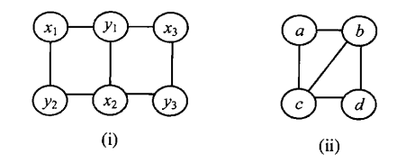

第3章 蛮力法

## 习题3.5
- 考虑下图。

  

  a.写出表示这个图的邻接矩阵和邻接链表(假设矩阵的行和列以及邻接链表中的顶点都是按照顶点标签的字母顺序排列的)

  a b c d e f g => 对应1 2 3 4 5 6 7的顺序排列

  邻接矩阵表示为：

  | 1    | 1    | 1    | 1    | 1    | 0    | 0    |
  | ---- | ---- | ---- | ---- | ---- | ---- | ---- |
  | 1    | 1    | 0    | 1    | 0    | 1    | 0    |
  | 1    | 0    | 1    | 0    | 0    | 0    | 1    |
  | 1    | 1    | 0    | 1    | 0    | 1    | 0    |
  | 1    | 0    | 0    | 0    | 1    | 0    | 1    |
  | 0    | 1    | 0    | 1    | 0    | 1    | 0    |
  | 0    | 0    | 1    | 0    | 1    | 0    | 1    |

  邻接链表表示：

  | a    | ->b  | ->c  | ->d  | ->e  |
  | ---- | ---- | ---- | ---- | ---- |
  | b    | ->a  | ->d  | ->f  |      |
  | c    | ->a  | ->g  |      |      |
  | d    | ->a  | ->f  |      |      |
  | e    | ->a  | ->g  |      |      |
  | f    | ->b  | ->d  |      |      |
  | g    | ->c  | ->e  |      |      |

  b.从节点a开始用深度优先查找来遍历图，按照字母顺序选择未访问的顶点，并构造相应的深度优先查找树。给出顶点第一次被访问到（压入遍历栈）的顺序以及这些顶点变为终点（出栈）的顺序。

  ```
  顶点入栈的顺序为：a=>b=>d=>f=>c=>g=>e
  ```

  ```
  顶点出栈的顺序为:f=>d=>b=e=>g=>c=>a
  ```

  

- 如果定义一个稀疏图，它的|E|∈O(|V|)，对于这样的图来说，哪一种DFS实现的时间效率更好，是使用邻接矩阵的实现，还是使用邻接链表的实现？

  ```
  采取邻接链表的实现方式更为高效。稀疏图如果采取邻接矩阵来实现，会存在大量的0元素位置，遍历会带来不小的时间开销，而采取邻接链表的方式只需要访问链表对应的节点即可。
  ```
  
- 假设G是一个有n个顶点和m条边的图，下列说法是对还是错？

  a.它的所有DFS森林(对应于不同顶点开始的遍历)包含相同数量的树。
  
  ```
  正确。森林中树的数量 = 顶点的数量
  ```
  
  b.它的所有DFS森林包含相同数量的树向边和回边。
  
  ```
  正确。因为不管从哪个顶点开始的遍历，其对应于每个顶点都存在一次延申的访问和回退的访问（入栈和出栈）
  ```

- 使用广度优先搜索对第一题中的图进行遍历，并构造相应的广度优先查找树。从顶点a开始遍历，在遇到多个可选顶点时，根据字母顺序来选择。

  ```
  采取广度优先搜索的方式，其搜索过程类似于墨水蔓延。最终的顺序为：a=>b=>c=>d=>f=>g=>e
  ```

  可以采取队列的方式来进行具体的实现，每当访问一个队列头部元素后，将没有访问的当前节点的后续节点入队列，直到所有节点访问完成，代码实现如下：

  ```c++
  void bfs(int matrix[][],int n) //大小为n的图，假设采取matrix邻接矩阵的方式进行表示，从节点0（a节点开始访问）
  {
    vector<bool> visit(n,false);
    queue<int> m_q;//访问队列
    m_q.push(0);
    visit[0] = true;
    while(m_q.empty()==false)
    {
      int node = m_q.front();
      m_visit_func(node);//访问该节点
      m_q.pop();//弹出
      for(int i=0;i!=node && i<n;i++)
      {
        if(visit[i]==false && matrix[node][i]==1) //若其后续节点没有被访问=》那么入队列
        {
          visit[i] = true;
          m_q.push_back(i);
        }
      }
    } 
  }
  ```

- a.请解释一下如何使用广度优先查找来检查图的无环性。

  ```
  若在访问一个节点A时，其后续节点B(注意这个后续节点B不能是节点A的前一个访问节点)在之前被访问过
  那么说明图中存在环，因为有其他路径已经到达过B节点。
  ```

  代码实现如下：

  ```
  bool judge_circle_by_bfs(int matrix[][],int n) //大小为n的图，假设采取matrix邻接矩阵的方式进行表示，从节点0（a节点开始访问）
  {
    
    vector<bool> visit(n,false);
    visit[0] = true;
    queue<int> m_q;//访问队列
    m_q.push(0);
    pre = 0;
    while(m_q.empty()==false)
    {
      int node = m_q.front();
      m_q.pop();//弹出
      pre = node;
      for(int i=0;i!=node && i<n;i++)
      {
        if(i == pre)
           continue;//注意跳过 开始到达的节点
        
        if( matrix[node][i]==1) //其后续节点i
        {
          if(visit[i])  //其后续节点i已经被访问 => 存在环
          {
            return true;
          }
          else
          {
            m_q.push_back(i);
          }
        }
      }
    } 
    return false;
  }
  ```

  b.在dfs遍历和bfs遍历中，是不是某种方法总比另外一种方法更快的找到回路？如果是，请指出哪一种遍历更快并解释原因；如果不是，请给出对应的两个例子。

  ```
  两种方法在不同的图下，速度存在差异，当dfs能很快找到一条回路时，那么dfs更快，而当dfs多次搜索无法找到回路时，则bfs显得更为稳定。
  ```

  请说明如何使用一下两种方法求得一个图的联通分量

  a.深度优先搜索

  ```
  采取该种策略，那么每一次进行dfs（每次从下一个没有被访问的顶点开始）操作时，将对应访问到的节点染颜色为color1，下一次开始dfs时，染颜色为color2，依次最后统计count有多少种color=》对应于有多少个连通分量
  ```

  ```
  
  int count_func()
  {
    int count = 0;
    for(int i=0;i<n;i++)
    {
      if(color[i]==-1) //每次从下一个没有访问的节点开始 dfs
      {
        count++;
        dfs(i);
      }
    }
    return coount;
  }
  void dfs(int i) 
  {
          color[i] = count;
          for (int k = 0; k < map[i].length; k++)
              if (color[k] == -1 && map[i][k] == 1)
                dfs(k);
  }
  ```

  b.广度优先搜索

  ```
  采取广度优先搜索的方式，和深度优先类似，都是每次将一个联通子图进行染色处理（bfs可以理解为墨水蔓延染色）
  ```

  ```
  int count_func()
  {
    int count = 0;
    for(int i=0;i<n;i++)
    {
      if(color[i]==-1) //每次从下一个没有访问的节点开始 dfs
      {
        count++;
        bfs(i);
      }
    }
    return coount;
  }
  void bfs(int i) //大小为n的图，假设采取matrix邻接矩阵的方式进行表示，从节点0（a节点开始访问）
  {
   
    queue<int> m_q;//访问队列
    m_q.push(i);
    color[i] = count;
    while(m_q.empty()==false)
    {
      int node = m_q.front();
      color[node]=i;//染色
      m_q.pop();//弹出
      for(int i=0;i!=node && i<n;i++)
      {
        if(color[i]==-1 && matrix[node][i]==1) //若其后续节点没有被访问=》那么入队列
        {
          color[i] = count;
          m_q.push_back(i);
        }
      }
    } 
  }
  ```

- 如果图的顶点可以分为两个不相交的子集X和Y，使得每条连接X中的顶点的边都连接着Y中的顶点，这样的图是二分图【也可以这样认为：如果只用两种颜色对图中顶点进行染色，就能使得每一条边上的两个顶点是不同颜色的，这样的图称为二分图】。下图中i是二分图，而ii不是二分图。

  

  a.设计一个基于DFS的算法来检查一个图是否为二分图

  ```
  二分图的定义是每条边的两个顶点需要是不同颜色，采取深度优先搜索的方式，从一个节点开始，将其染色为color_A，然后其后续节点染色为color_B，这样不断搜索下去可以将所有节点进行染色。
  若在中途出现一条边的两个节点为相同的颜色=》不是二分图
  若在中途没有出现一条边的两个节点为相同颜色=》是二分图
  ```

  代码实现如下：

  ```
  bool judge_by_dfs(int i,int color_now) 
  {
          color[i] = color_now; //当前节点染色color_now
          for (int k = 0; k < map[i].length; k++)
              if (map[i][k] == 1) //一个后续节点k（即i和k有边相互连接）
              {
                if(color[k]==color][i]) //这个节点已经访问过 并且和当前节点相同颜色
                {
                  return false;//不是二分图
                }
                else if(color[k]==0) //还没有染色 即没有被访问
                {
                  dfs(k, 0 - color_now) //那么染色为相反的颜色
                }  
              }
         return true;//若所有节点都可以按照二分规则染上颜色 那么为二分图         
  }
  ```

  b.设计一个基于BFS的算法来检查一个图是否为二分图

  ```
  采取广度优先搜索的方式，从一个节点开始，将其染色为color_A，然后其下一层所有后续节点染色为color_B，这样不断搜索下去可以将所有节点进行染色。
  类似于层次遍历的方式进行bfs
  若在中途出现一层的两个节点相互连接（存在边）=》不是二分图
  若在中途没有出现一层的两个节点相互连接=》是二分图
  ```

  代码实现如下：

  ```
  bool judge_circle_by_bfs(int matrix[][],int n) //大小为n的图，假设采取matrix邻接矩阵的方式进行表示，从节点0（a节点开始访问）
  {
    vector<bool> visit(n,false);
    visit[0] = true;
    queue<int> m_q;//访问队列
    m_q.push(0);
    while(m_q.empty()==false)
    {
      int len = m_q.size();//一层一层的访问
      vector<int> now_circle_nodes;  //当前层节点
      for(int i=0;i<len;i++)
      {
         int node = m_q.front();
         m_q.pop();//弹出
        now_circle_nodes.push_back(node);
        for(int k=0;k!=node && k<n;k++)
        {
        
          if(matrix[node][k]==1) //若其后续节点
         {
            if(visit[k])  //其后续节点已经被访问 存在环
           {
             return true;
           }
           else
          {
            m_q.push_back(k);
          }
         }
        } 
      }
      //判断当前层len个节点是否存在边相互连接
      for(auto i:now_circle_nodes)
        for(auto j:now_circle_nodes)
        {
          if(i!=j && matrix[i][j]==1)  //同一层存在相互连接的边，由于同一层为相同的颜色，故不符合二分图定义
            return false;
        }
    } 
    return true;
  }
  
  ```

  

